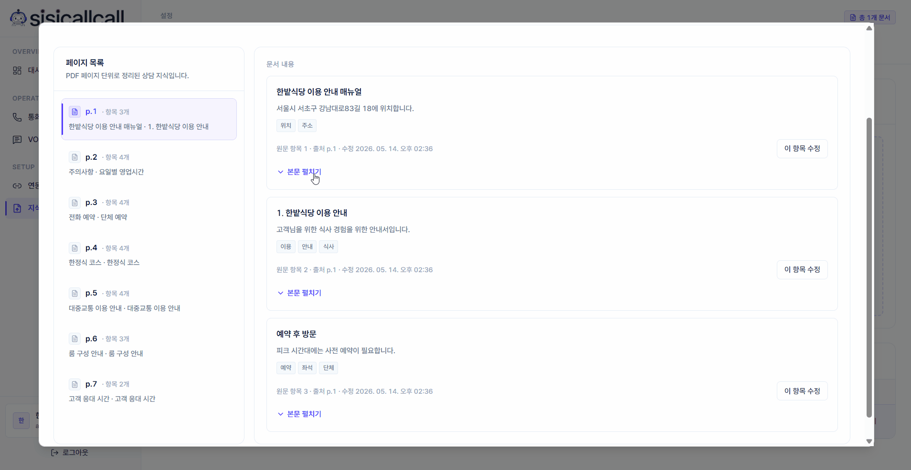
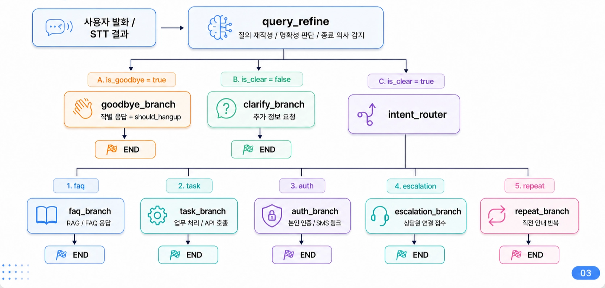
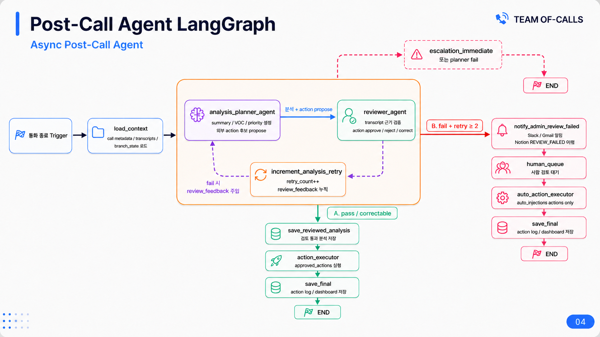

# 시시콜콜 Sisicallcall

> AI 음성 상담, RAG, Post-Call 분석, 외부 업무도구 연동을 연결한 B2B 고객상담 SaaS 플랫폼

<table align="center">
  <tr>
    <td align="center" width="680">
      <a href="https://www.notion.so/3e8441f66d7883d4834081470e78583d?pvs=1"><b>📘 Notion Project Page</b></a><br />
      <sub>프로젝트 상세 문서 · 구현 과정 · 역할 정리 보기</sub>
    </td>
  </tr>
</table>

<p align="center">
  <a href="https://github.com/KDY0829/sisicallcall/raw/main/assets/sisicallcall.mp4">
    
  </a><br />
  <sub>▶ 이미지를 클릭하면 실행 영상을 볼 수 있습니다.</sub>
</p>

<p align="center">
  
</p>

## ✨ Highlights

| 구분 | 내용 |
|---|---|
| 문제 | 반복 문의, 상담 대기, 상담 이후 후속 처리 지연 |
| 해결 | AI Call Agent + RAG + Post-Call Agent + MCP 외부 도구 연동 |
| 담당 | 화자검증 파인튜닝, Post-Call Agent 설계/구현, 대시보드, 배포 |
| 결과 | 통화 요약, VOC 분석, 우선순위 판단, 후속 액션 자동화 구현 |

---

## 1. 프로젝트 개요

시시콜콜은 PDF 매뉴얼만 업로드하면 AI가 실제 전화 상담을 받고, 통화 종료 후에는 상담 내용을 요약·분석해 후속 업무까지 자동화하는 B2B 고객상담 SaaS 플랫폼입니다.

실시간 통화 구간은 응답 속도가 중요하기 때문에 Call Agent로 분리했고, 통화 종료 후 무거운 분석과 외부 업무 연동은 Post-Call Agent에서 비동기로 처리하도록 구성했습니다.

---

## 2. 주요 기능

| 영역 | 기능 |
|---|---|
| 실시간 통화 | Twilio 기반 전화 수신, STT, 의도 분류, RAG/Task 처리, TTS 응답 |
| RAG 지식 관리 | 기업별 PDF 매뉴얼 업로드, chunking, embedding, tenant별 문서 관리 |
| Post-Call 분석 | 통화 요약, VOC 분석, 고객 감정, 해결 상태, 우선순위 판단 |
| 검토 루프 | Planner / Reviewer Agent 기반 분석 검증 및 재분석 흐름 |
| 외부 연동 | Slack, Jira, Notion, Calendar 등 업무 도구 연동 자동화 |
| 멀티테넌시 | tenant_id 기반 통화, 문서, 분석 결과 분리 저장 |

---

## 3. My Role

- TitaNet 기반 화자검증 모델 파인튜닝 및 전화망 환경 도메인 적응 실험
- Post-Call Agent 전체 흐름 설계 및 구현
- 통화 요약, VOC 분석, 우선순위 판단, 후속 액션 제안 구조 설계
- Planner / Reviewer Agent 기반 검증 루프 설계
- 관리자 대시보드 설계 및 배포
- PostgreSQL / Redis / ChromaDB 기반 로컬 실사용 환경 구성

---

## 4. Architecture

### Call Agent Pipeline

<p align="center">
  
</p>

```text
고객 전화
  → Twilio Media Stream
  → VAD / STT
  → Intent Router
  → faq / task / auth / escalation / repeat branch
  → RAG 또는 API 처리
  → TTS 응답
```

실시간 통화 경로는 지연 시간을 줄이기 위해 branch 기반으로 구성했습니다. 자주 발생하는 문의는 KNN Router와 semantic cache로 빠르게 처리하고, 복잡한 업무는 필요한 branch에서만 LLM과 tool을 사용하도록 설계했습니다.

### Post-Call Agent Pipeline

<p align="center">
  
</p>

```text
통화 종료
  → transcript / call context 로드
  → analysis_planner_agent
  → reviewer_agent 검토
  → save_reviewed_analysis
  → action_executor
  → Slack / Jira / Notion / Calendar 후속 액션
```

Post-Call Agent는 통화 내용을 기반으로 상담 요약, VOC, 우선순위, 후속 조치를 생성합니다. Reviewer Agent가 분석 결과를 검토하고, 실패하거나 보정 가능한 결과는 feedback을 주입해 재분석하도록 구성했습니다.

---

## 5. Tech Stack

| 영역 | 기술 |
|---|---|
| Language | Python, TypeScript |
| Backend | FastAPI, WebSocket, asyncio |
| Agent | LangGraph, LangChain, OpenAI GPT-4o / GPT-4o-mini |
| RAG | ChromaDB, OpenAI Embeddings, PDF Chunking |
| Voice | Twilio, Deepgram STT, TTS, Silero VAD |
| Speaker Verification | TitaNet-S, ONNX, Telephony Augmentation |
| Database | PostgreSQL, Redis, ChromaDB |
| Frontend | Vite, React, TypeScript, React Flow |
| Integration | Slack, Jira, Notion, Calendar, MCP |
| Infra | Docker, Docker Compose |

---

## 6. Database

주요 테이블은 모두 `tenant_id`를 기준으로 멀티테넌시를 고려해 설계했습니다.

```text
tenants
calls
transcripts
call_summaries
voc_analyses
rag_documents
knn_intents
mcp_action_logs
```

---

## 7. Quick Start

### Backend

```bash
cp .env.example .env
make up
make seed

export STARTUP_PROFILE=full
python scripts/run_dev.py
```

### Frontend

```bash
cd front
npm ci
npm run dev
```

### Health Check

```text
http://127.0.0.1:8000/health
```

---

## 8. Team

| 이름 | 담당 |
|---|---|
| 김대영 | 화자검증 파인튜닝, Post-Call Agent, 대시보드, 배포 |
| 이희원 | 얼굴 인증, Call Agent LangGraph, 프론트엔드, DB 설계 |
| 김주미 | 임베딩 모델 연구, PDF Chunking, 후처리 Agent |
| 김신용 | 임베딩 모델 연구, PDF Chunking, 후처리 Agent |
| 안희영 | VAD 모델 연구, LangGraph VAD 노드, KNN Router |
| 김수현 | Intent Router, 비전 모델 연구 |

---

## 9. Repository

```text
app/                FastAPI backend, agents, repositories
front/              React dashboard
scripts/            local run / post-call / DB utility scripts
db/init/            PostgreSQL schema initialization
tests/              unit and integration tests
```
